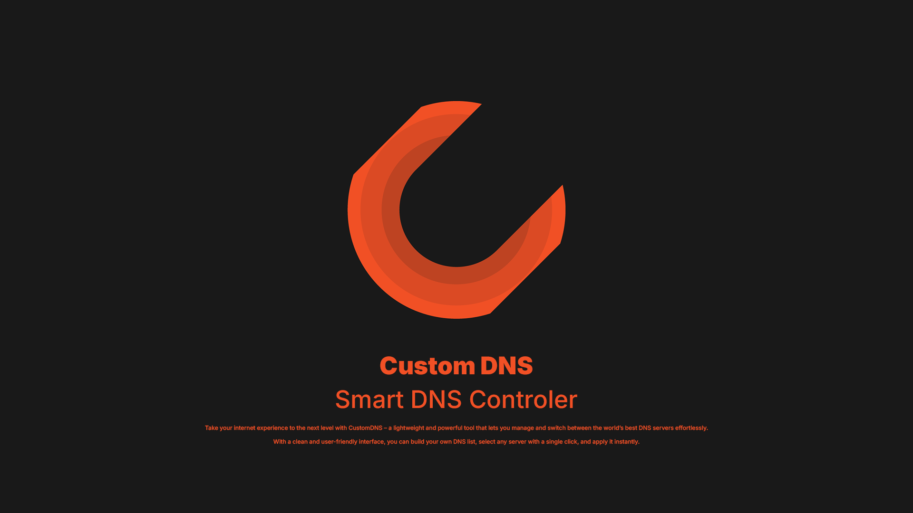

  

## Custom DNS

Custom DNS is a lightweight and modern Windows application that allows you to save, organize, and switch between custom DNS servers with ease.

## Features

- Modern and clean user interface.
- Save unlimited custom DNS servers.
- Assign a unique name to each DNS entry for easier identification.
- Quickly switch between saved DNS profiles.
- Connect or disconnect with a single tap.
- Includes several popular public DNS providers out of the box.
- Stores all DNS configurations locally on your device.

## Built-in DNS Providers

- Google DNS
- Cloudflare DNS
- Quad9 DNS
- AdGuard DNS
- OpenDNS

## How to Use

1. Launch the application.
2. Choose one of the built-in DNS providers or create your own.
3. Enter a unique name for your DNS configuration.
4. Save it to your list.
5. Select it and tap **Connect** to activate it.
6. Tap **Disconnect** whenever you want to disable it.

## Technology

- .NET WPF
- C#
- MVC Architecture
